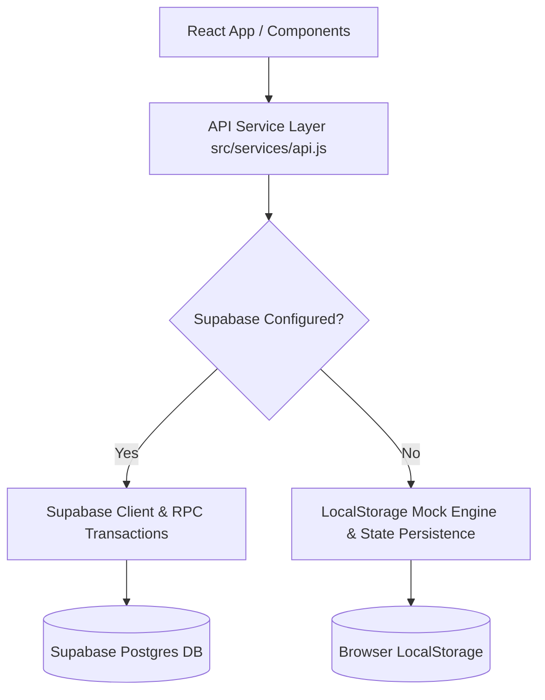

# POS System — Core Architectural & System Brain Reference

This file serves as the definitive **Brain & Architecture Reference** for the **Point of Sale (POS) Web Application**. It documents the complete system architecture, data models, state flows, component breakdown, API layer, and deployment setup.

---

## 1. Executive Summary & Tech Stack

The application is a modern, responsive, high-performance Point of Sale system built for retail & small business environments. It is designed to work seamlessly on both mobile devices and desktop screens, offering real-time stock management, fast checkout flows, transaction receipts, and sales analytics.

### Core Tech Stack

| Technology | Role | Details |
| :--- | :--- | :--- |
| **Vite** | Build Tool & Dev Server | Fast HMR, optimized production bundler |
| **React 18** | UI Framework | Functional components, hooks, Context API |
| **Tailwind CSS** | Styling Engine | Custom color tokens, responsive utilities, dark mode support |
| **React Router v7** | Navigation | `HashRouter` for GitHub Pages compatibility |
| **Supabase** | Backend / Database / Auth | PostgreSQL, Row Level Security (RLS), Auth, Realtime stored procedures |
| **Lucide React** | Iconography | Lightweight, consistent SVG icon set |
| **LocalStorage API** | Offline / Demo Mode | Automatic fallback system when Supabase parameters are absent |

---

## 2. System Architecture & Dual-Mode Execution

The system features an **Adaptive Data Layer** (`src/services/api.js`). It automatically detects whether Supabase credentials (`VITE_SUPABASE_URL` and `VITE_SUPABASE_ANON_KEY`) are configured:



### Dual-Mode Capabilities
1. **Supabase Cloud Mode**: Uses real-time queries and atomic database functions (`create_order_atomic`) for stock validation and transactions.
2. **Mock Demo Mode**: Persists products, categories, and order histories directly into browser `localStorage` using keys:
   - `pos_mock_products_v1`
   - `pos_mock_categories_v1`
   - `pos_mock_orders_v1`

---

## 3. Database Schema & Data Models

### Supabase PostgreSQL Schema (`supabase_schema.sql`)

```sql
-- 1. Categories Table
CREATE TABLE public.categories (
    id UUID PRIMARY KEY DEFAULT uuid_generate_v4(),
    name TEXT NOT NULL UNIQUE,
    created_at TIMESTAMP WITH TIME ZONE DEFAULT NOW()
);

-- 2. Products Table
CREATE TABLE public.products (
    id UUID PRIMARY KEY DEFAULT uuid_generate_v4(),
    name TEXT NOT NULL,
    price NUMERIC(10, 2) NOT NULL CHECK (price >= 0),
    cost NUMERIC(10, 2) DEFAULT 0 CHECK (cost >= 0),
    sku TEXT UNIQUE NOT NULL,
    category_id UUID REFERENCES public.categories(id) ON DELETE SET NULL,
    stock_qty INT NOT NULL DEFAULT 0 CHECK (stock_qty >= 0),
    image_url TEXT,
    created_at TIMESTAMP WITH TIME ZONE DEFAULT NOW()
);

-- 3. User Profiles Table (Linked to auth.users)
CREATE TABLE public.user_profiles (
    id UUID PRIMARY KEY REFERENCES auth.users(id) ON DELETE CASCADE,
    email TEXT NOT NULL,
    full_name TEXT,
    role TEXT NOT NULL CHECK (role IN ('admin', 'cashier')) DEFAULT 'cashier',
    created_at TIMESTAMP WITH TIME ZONE DEFAULT NOW()
);

-- 4. Orders Table
CREATE TABLE public.orders (
    id UUID PRIMARY KEY DEFAULT uuid_generate_v4(),
    cashier_id UUID REFERENCES auth.users(id),
    customer_name TEXT DEFAULT 'Walk-in Customer',
    subtotal NUMERIC(10, 2) NOT NULL CHECK (subtotal >= 0),
    discount NUMERIC(10, 2) DEFAULT 0 CHECK (discount >= 0),
    tax NUMERIC(10, 2) DEFAULT 0 CHECK (tax >= 0),
    total NUMERIC(10, 2) NOT NULL CHECK (total >= 0),
    payment_method TEXT NOT NULL CHECK (payment_method IN ('cash', 'card', 'mobile')),
    status TEXT NOT NULL DEFAULT 'completed' CHECK (status IN ('completed', 'refunded', 'voided')),
    created_at TIMESTAMP WITH TIME ZONE DEFAULT NOW()
);

-- 5. Order Items Table
CREATE TABLE public.order_items (
    id UUID PRIMARY KEY DEFAULT uuid_generate_v4(),
    order_id UUID REFERENCES public.orders(id) ON DELETE CASCADE,
    product_id UUID REFERENCES public.products(id),
    product_name TEXT NOT NULL,
    qty INT NOT NULL CHECK (qty > 0),
    unit_price NUMERIC(10, 2) NOT NULL CHECK (unit_price >= 0),
    subtotal NUMERIC(10, 2) NOT NULL CHECK (subtotal >= 0)
);

-- 6. Payments Table
CREATE TABLE public.payments (
    id UUID PRIMARY KEY DEFAULT uuid_generate_v4(),
    order_id UUID REFERENCES public.orders(id) ON DELETE CASCADE,
    method TEXT NOT NULL,
    amount NUMERIC(10, 2) NOT NULL CHECK (amount >= 0),
    change_due NUMERIC(10, 2) DEFAULT 0 CHECK (change_due >= 0),
    created_at TIMESTAMP WITH TIME ZONE DEFAULT NOW()
);
```

### Atomic Order Stored Procedure (`create_order_atomic`)
Guarantees transaction integrity (ACID) by locking stock rows (`FOR UPDATE`), checking stock availability, creating order records, creating payment entries, and decrementing stock in a single transaction block.

---

## 4. Component & File Directory Tree

```
posSystem/
├── .env.example                # Supabase environment template
├── .env.local                  # Local environment configuration
├── index.html                  # HTML template with standard viewport settings
├── package.json                # Project dependencies and script scripts
├── pos-system-antigravity-prompt.md # Initial design specifications
├── supabase_schema.sql         # SQL schema definition & RLS policies
├── tailwind.config.js          # Tailwind theme extensions & colors
├── vite.config.js              # Vite bundler & base URL setup
└── src/
    ├── App.jsx                 # Main application router & protected layouts
    ├── index.css               # Global styles, fonts, and dark mode baseline
    ├── main.jsx                # Entry point mounting App
    ├── components/
    │   ├── checkout/
    │   │   ├── CartPanel.jsx       # Cart sidebar/panel with item list, qty controls, tax/discount calculation
    │   │   ├── PaymentModal.jsx    # Payment calculation modal (Cash/Card/Mobile, quick cash buttons)
    │   │   ├── ProductCard.jsx     # Individual product grid item with stock status & quick add button
    │   │   ├── ProductGrid.jsx     # Category filtering tabs, search input, and responsive grid layout
    │   │   └── ReceiptModal.jsx    # Printable receipt modal with itemized breakdown
    │   ├── layout/
    │   │   ├── Navbar.jsx          # Top navigation bar with dark mode toggle & user menu
    │   │   └── Sidebar.jsx         # Main navigation sidebar (Checkout, Products, Orders, Analytics)
    │   └── products/
    │       ├── CategoryModal.jsx   # Modal for adding new categories
    │       └── ProductModal.jsx    # Modal for creating and updating product inventory
    ├── context/
    │   ├── AuthContext.jsx     # User authentication state, role evaluation, & login/logout methods
    │   ├── CartContext.jsx     # Active shopping cart items, discount, tax rate, & quantity actions
    │   └── ThemeContext.jsx    # Light / Dark mode context synced with document element
    ├── lib/
    │   └── supabase.js         # Supabase client instantiation and status check
    ├── pages/
    │   ├── CheckoutPage.jsx    # Primary register layout (Product Grid + Cart Panel)
    │   ├── DashboardPage.jsx   # Analytics overview (Sales total, Order volume, Stock metrics, Charts)
    │   ├── LoginPage.jsx       # Authentication view with demo credentials toggle
    │   ├── OrdersPage.jsx      # Historical sales ledger, date filter, receipt inspection
    │   └── ProductsPage.jsx    # Inventory manager (CRUD operations for products & categories)
    └── services/
        ├── api.js              # Abstraction layer balancing Supabase RPC and LocalStorage Mock engine
        └── mockData.js         # Default initial dataset (categories, sample products, historical orders)
```

---

## 5. State Management & Context Architecture

### 1. AuthContext (`src/context/AuthContext.jsx`)
- Controls `user`, `role` (`admin` | `cashier`), and `loading` state.
- Supports login, logout, and automatically provisions a mock demo user if Supabase is offline.

### 2. CartContext (`src/context/CartContext.jsx`)
- Manages active cart items `[ { product, quantity } ]`.
- Features: `addToCart`, `removeFromCart`, `updateQuantity`, `clearCart`, `applyDiscount`, `setCustomerName`.
- Auto-calculates:
  - `subtotal` = $\sum (\text{price} \times \text{qty})$
  - `tax` = $\text{subtotal} \times 8\%$
  - `total` = $\text{subtotal} + \text{tax} - \text{discount}$

### 3. ThemeContext (`src/context/ThemeContext.jsx`)
- Controls light/dark mode preference stored in `localStorage`.
- Syncs the `.dark` CSS class onto `document.documentElement`.

---

## 6. Key Features Overview

1. **Checkout & POS Screen**:
   - Live product search & category filtering tabs.
   - Real-time stock display with visual alerts for low/out of stock items.
   - Instant cart calculations (Subtotal, Tax, Custom Discounts).
   - Mobile-first adaptive view tabbed between Product selection and Cart summary.

2. **Payment Processing & Modal**:
   - Supports **Cash**, **Credit Card**, and **Mobile Money** payments.
   - Quick Cash presets (\$10, \$20, \$50, \$100, Exact).
   - Instant change due calculation.
   - Pre-checkout stock verification prevents over-selling.

3. **Printable Transaction Receipts**:
   - Thermal-style receipt print view.
   - Itemized product list, taxes, discounts, cashier name, transaction timestamp, and barcode representation.

4. **Product & Category Inventory Management**:
   - Create, edit, and delete products (SKU, Price, Cost, Category, Stock Qty, Image URL).
   - Category creation and product filter association.
   - Searchable and sortable inventory table.

5. **Order Ledger & History**:
   - Chronological list of historical sales.
   - Detailed modal inspector to review past receipts.
   - Search by Order ID, Cashier Name, or Customer Name.

6. **Analytics & Dashboard Overview**:
   - Total Sales Revenue metric cards.
   - Total Orders count & Average Order Value (AOV).
   - Top Selling Products chart & Low Stock inventory alerts.

---

## 7. Deployment & Environment Setup

### Environment Variables (`.env.local`)
```env
VITE_SUPABASE_URL=https://your-supabase-project.supabase.co
VITE_SUPABASE_ANON_KEY=your-supabase-anon-key
```

### GitHub Pages Deployment
The project is configured with `HashRouter` in `App.jsx` and `base: './'` in `vite.config.js` to ensure proper URL routing without server rewrite rules:

```bash
# Build production bundle
npm run build

# Deploy to GitHub Pages
npm run deploy
```

---

## 8. Development Commands Summary

| Command | Action |
| :--- | :--- |
| `npm run dev` | Starts local Vite dev server |
| `npm run build` | Compiles production assets into `/dist` |
| `npm run preview` | Previews production build locally |
| `npm run deploy` | Deploys `/dist` to GitHub Pages repository branch |

---
*Brain document automatically generated and updated for posSystem codebase.*
